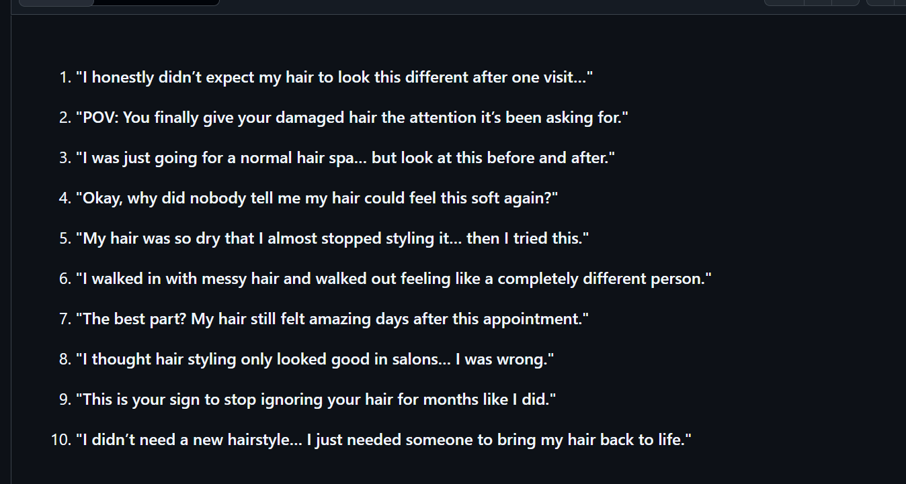
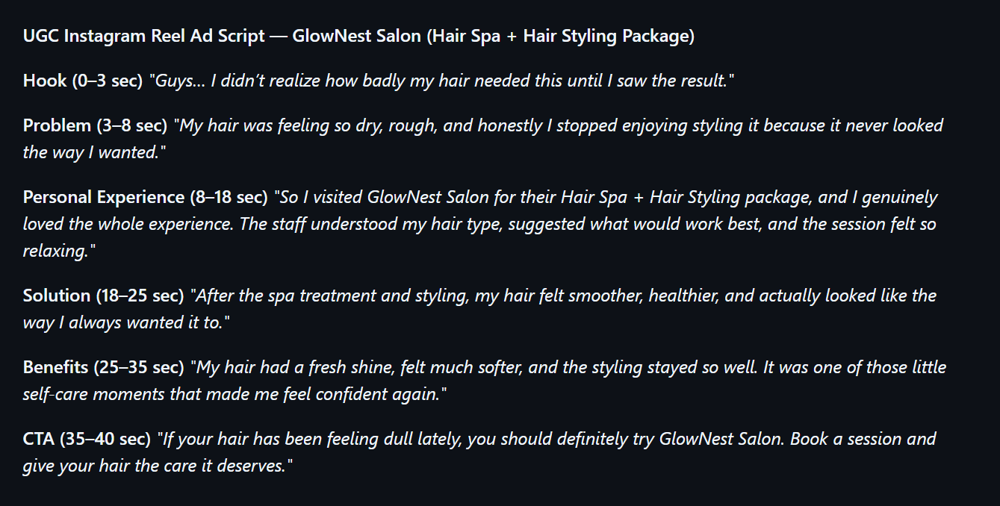
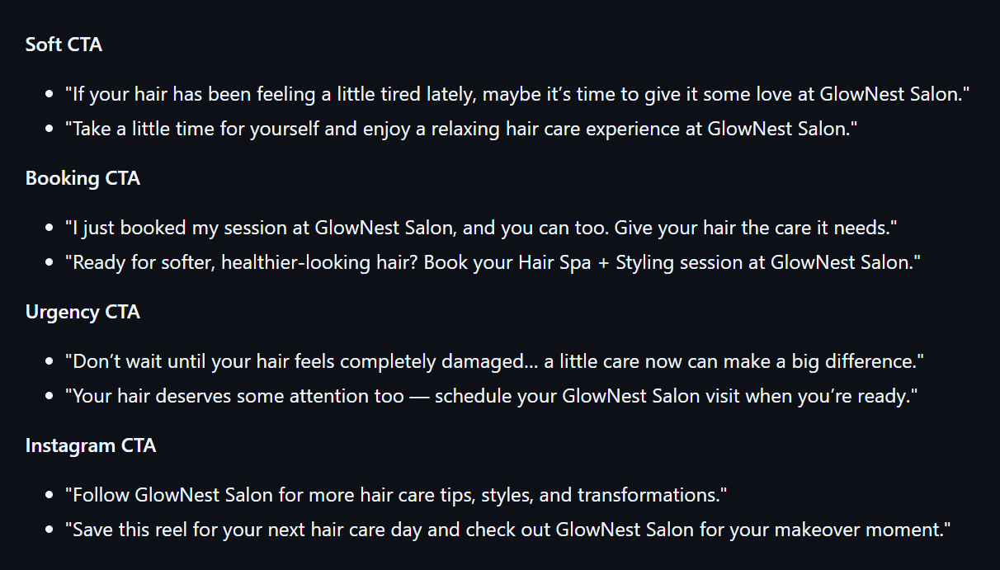

# AI UGC Ad Content Generator

## Project Overview

This project demonstrates how AI and Prompt Engineering can be used to create authentic UGC-style advertising content for local businesses.

The goal is to generate ad scripts that feel natural, human and suitable for Instagram marketing.

---

## Business Selected

### GlowNest Salon - Hyderabad

Business Type:
Unisex Salon

Campaign:
Hair Spa + Hair Styling Package

Target Audience:
Women and men interested in beauty and grooming services

---

## Problem

Traditional advertisements often feel promotional and less relatable.

Businesses need content that feels like real customer experiences.

---

## Solution

Created a reusable AI prompt system that generates:

- UGC ad hooks
- Short video scripts
- CTA lines
- Platform-specific content

---

## Prompt Logic

The prompts use:

- Business details
- Target audience
- Product/service information
- UGC frameworks
- Platform requirements

to create realistic marketing content.

---

## Tools Used

- ChatGPT
- GitHub
- CapCut (Optional)

---

## Generated Content

This repository contains:

- Structured AI prompts
- UGC hooks
- Ad scripts
- CTA content

---

## Outcome

Created an AI-powered UGC content system that can be reused for different brands and local businesses.
## Screenshots

### UGC Hooks

### UGC Ad Script

### CTA Examples

